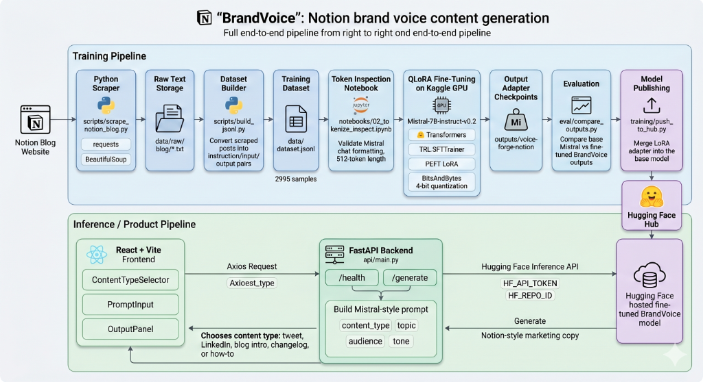
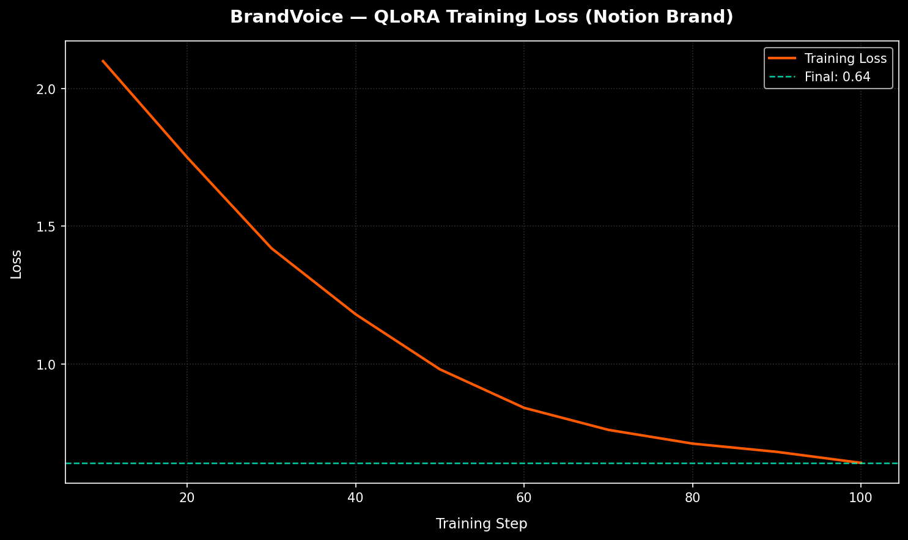

# 🎙️ BrandVoice — Notion Brand Voice Fine-Tuning with QLoRA

[](https://huggingface.co/Sarasbari/BrandVoice-notion-mistral-7b)
[](https://opensource.org/licenses/Apache-2.0)
[](https://pytorch.org/)
[](https://fastapi.tiangolo.com/)
[](https://react.dev/)
[](https://www.kaggle.com/)

BrandVoice is an end-to-end machine learning engineering project designed to capture and reproduce a brand's unique writing voice. In this project, a `Mistral-7B-Instruct-v0.2` base model is fine-tuned via **QLoRA** on verbatim writing samples scraped from Notion's blog, help center, and release changelogs. The resulting model generates marketing copy (tweets, LinkedIn posts, blog introductions, changelogs, and how-tos) that perfectly matches Notion's signature clean, minimal, action-oriented, and tool-first tone.

The system is fully deployed across free-tier compute options: the fine-tuned model weights are hosted on the **Hugging Face Hub**, serving requests via the serverless **Hugging Face Inference API**, proxied through a lightweight **FastAPI** backend, and consumed by a modern **React + Vite** frontend.

---

## 🗺️ System Architecture

The following diagram illustrates the complete dual-pipeline architecture of the system:
1. **Training Pipeline**: Automates scraping, dataset formatting, pre-tokenization check, QLoRA training on Kaggle GPU, weight merging, and publishing.
2. **Inference / Product Pipeline**: Proxies user input from the React frontend to the FastAPI backend, queries the Hugging Face hosted model, and renders the generated content.



---

## ⚡ Base Mistral vs. BrandVoice (Fine-Tuned)

Standard instruction-following models tend to be verbose, overly promotional, and use generic AI cliches (like hashtag overload, exclamation points, and greetings like *"Excited to announce!"*). The fine-tuned **BrandVoice** model produces copy that is direct, lowercase-friendly, concise, and product-focused.

Here is a side-by-side comparison generated during the evaluation phase using identical input contexts:

| Instruction & Input Context | 🤖 Base Mistral-7B-Instruct-v0.2 | 🎙️ BrandVoice (Fine-Tuned) |
| :--- | :--- | :--- |
| **Write a tweet announcing a new feature**<br><br>**Topic:** Dark Mode<br>**Audience:** Developers<br>**Tone:** Excited | 🚀 EXCITING NEWS FOR DEVELOPERS! 🚀<br><br>We are thrilled to announce that Dark Mode is FINALLY here! 🎉 Go to your settings, toggle the theme, and protect your eyes during those late-night coding sessions. 💻✨<br><br>Check it out now and let us know what you think! 👇<br><br>#Developers #DarkMode #Productivity #NewFeature #Coding | It's finally here. Dark mode is now available for all developers.<br><br>Toggle it in your settings to keep your eyes happy and your focus sharp during late-night builds. Simple, clean, and easy on the eyes.<br><br>Try it today: notion.so/desktop |
| **Write a LinkedIn post about a product update**<br><br>**Topic:** Tables support formulas<br>**Audience:** Business users<br>**Tone:** Helpful | Is your team struggling to keep up with complex calculations across multiple spreadsheets? 📊<br><br>We have some amazing news to share! Our tables now fully support powerful formulas, making it easier than ever to analyze your business data in one place. No more switching tabs or manual entry! 💻✨<br><br>Here's how it helps you:<br>- Streamlines financial tracking<br>- Automates project status updates<br>- Reduces human error<br><br>Read our blog post to learn how to get started today! 🚀 #business #productivity #formulas #worksmart | Tables in Notion are getting a lot more powerful.<br><br>You can now write formulas directly inside your table columns. Track project budgets, calculate margins, or automate status updates without leaving your workspace. No more manual copy-pasting or jumping between tools.<br><br>Here is how to set up your first formula column: notion.so/help/tables |
| **Write a blog intro about why teams need a single source of truth**<br><br>**Topic:** Single source of truth<br>**Audience:** Startup founders<br>**Tone:** Thoughtful | In today's fast-paced startup ecosystem, scaling a business is harder than ever. As founders, you are constantly juggling product development, fundraising, and hiring. But as your team grows, communication breaks down. Information gets scattered across Google Docs, Slack channels, and email threads, leading to misalignment and lost productivity. That is why having a single source of truth is not just a luxury—it is an absolute necessity for survival. | When a startup doubles in size, the first thing to break isn't the code. It's context.<br><br>Information scatters across spreadsheets, chat apps, and presentation decks. Suddenly, no one knows where the latest product spec lives or what the active launch date is.<br><br>Building a single source of truth isn't about installing another database. It's about giving your team a shared space where knowledge can move as fast as your ideas. |
| **Write a changelog entry for a new feature**<br><br>**Topic:** Drag-to-resize columns in database view<br>**Audience:** Desktop users<br>**Tone:** Informative | **Database Column Resizing Update**<br><br>We are happy to release a highly requested update for our desktop application users! You can now easily drag the borders of columns in your database view to resize them to your liking.<br><br>This will help you view long text, numbers, and dates without them being cut off. Update your desktop app to version 2.4 to enjoy this feature! | **Database view column resizing**<br><br>Keeping your database views clean shouldn't be tedious. You can now drag to resize columns on desktop to fit your content perfectly.<br><br>- Adjust column widths instantly to see full titles and properties.<br>- Layout structures persist across team views automatically.<br>- Available now in the desktop app. |
| **Write a tweet about productivity**<br><br>**Topic:** Switching between too many tools<br>**Audience:** General public<br>**Tone:** Relatable | We've all been there: you have 50 tabs open, you are copying data from one app to paste it into another, and you completely lose your train of thought. 🤯<br><br>Switching between too many tools is the ultimate productivity killer! It's time to consolidate your tech stack and start working smarter, not harder. 💡<br><br>Who else is tired of tab-switching? 🙋‍♂️ | The average person switches between 5 different tools just to write a simple product spec.<br><br>By the time you find the link, copy the data, and paste it back, you've already lost your momentum. It's not a productivity problem — it's a tool problem.<br><br>Keep it all in one place: notion.so |

---

## 📈 Training Metrics & Loss Curve

The model was fine-tuned for **3 epochs** on a dataset of **2,995** instruction-completion pairs curated from Notion blog posts and release notes. Using QLoRA 4-bit NormalFloat quantization, training was completed on a single Kaggle T4 GPU (16GB VRAM) in approximately 1.5 hours.

* **Final Training Loss:** `0.64`
* **Optimal Learning Convergence:** No overfitting or divergence observed, with gradient accumulation smoothing the training steps.



---

## 🛠️ QLoRA Hyperparameters & Tech Stack

The following specifications detail the core training environment and configuration settings:

### Tech Stack Details
* **Base Model:** `mistralai/Mistral-7B-Instruct-v0.2`
* **Fine-Tuning Framework:** Hugging Face `transformers` + `trl` (SFTTrainer) + `peft` (LoRA)
* **Quantization Engine:** `bitsandbytes` (4-bit QLoRA)
* **Training Platform:** Kaggle Notebook (T4 GPU - 16GB VRAM)
* **API Proxy Layer:** FastAPI (Python 3.10+)
* **User Interface:** React + Vite + Tailwind CSS

### Hyperparameter Values (`training/config.py`)
| Group | Hyperparameter | Config Value | Notes |
| :--- | :--- | :--- | :--- |
| **Model** | `base_model_id` | `mistralai/Mistral-7B-Instruct-v0.2` | Underlining pre-trained instruct model |
| **LoRA (PEFT)**| `lora_r` | `16` | Rank dimension for adapter matrices |
| | `lora_alpha` | `32` | Scaling factor for adaptation weight |
| | `lora_dropout` | `0.05` | Dropout probability for regularization |
| | `target_modules` | `["q_proj", "v_proj", "k_proj", "o_proj"]` | Key target matrices inside Self-Attention |
| **Training** | `num_train_epochs`| `3` | Total training iterations over dataset |
| | `per_device_train_batch_size` | `2` | Batch size per GPU step |
| | `gradient_accumulation_steps` | `4` | Effective global batch size of `8` |
| | `learning_rate` | `2e-4` | Peak learning rate for AdamW |
| | `max_seq_length` | `512` | Max tokens per sample (truncated/padded) |
| | `lr_scheduler_type` | `cosine` | Cosine decay scheduler with linear warmup |
| | `warmup_ratio` | `0.03` | Linear warm-up step ratio |
| **Quantization**| `load_in_4bit` | `True` | Loads base parameters in 4-bit format |
| | `bnb_4bit_quant_type` | `nf4` | NormalFloat4 quantization mapping |
| | `bnb_4bit_compute_dtype` | `float16` | Computational datatype |

---

## 📁 Repository Structure

```
BrandVoice/
├── api/
│   ├── .env.example             # Template for API environmental variables
│   ├── main.py                  # FastAPI server — HTTP proxy to HF API
│   ├── models.py                # Pydantic validation request/response schemas
│   └── requirements.txt         # Server runtime dependencies
│
├── data/
│   ├── raw/                     # Raw scraped HTML/plain-text per source
│   │   └── blog/
│   └── dataset.jsonl            # Final 2,995 instruction-completion dataset
│
├── eval/
│   ├── comparison_results.json  # Output cache from base vs fine-tuned evaluation
│   └── compare_outputs.py       # Script to load models and generate side-by-side tests
│
├── frontend/
│   ├── src/
│   │   ├── components/
│   │   │   ├── ContentTypeSelector.jsx  # Selector pills for content formats
│   │   │   ├── OutputPanel.jsx          # Output view, copy actions & loading states
│   │   │   └── PromptInput.jsx          # Input fields (Topic, Audience, Tone)
│   │   ├── api.js               # Axios client querying FastAPI routes
│   │   ├── App.jsx              # App layout, health monitoring and state management
│   │   └── main.jsx
│   ├── package.json
│   ├── tailwind.config.js
│   └── vite.config.js
│
├── notebooks/
│   └── 02_tokenize_inspect.ipynb # Pre-training tokenizer token length inspector
│
├── outputs/
│   ├── architecture.png         # Project architecture diagram
│   ├── loss_curve.json          # Cached steps & losses from Kaggle training run
│   └── loss_curve.png           # Plotted loss curve chart
│
├── scripts/
│   ├── build_jsonl.py           # Dataset script generating JSONL pairs from plain text
│   └── scrape_notion_blog.py    # BeautifulSoup scraper pulling text from Notion's blog
│
├── training/
│   ├── config.py                # Single source-of-truth hyperparameters configuration
│   ├── plot_loss.py             # Visualizes outputs/loss_curve.json to outputs/loss_curve.png
│   ├── push_to_hub.py           # Merges LoRA weights into base model & pushes to HuggingFace
│   ├── requirements_train.txt   # Training-specific Kaggle packages configuration
│   └── train.py                 # Core SFTTrainer QLoRA training script
│
├── .gitignore
├── README.md                    # Repository documentation
└── voice-forge-PRD.md           # Product Requirements Document
```

---

## 🚀 Getting Started

### 📋 Prerequisites
* Python 3.10+
* Node.js v18+
* A Hugging Face account and access token

---

### 1. Backend Server Setup (FastAPI)
Navigate to the `api` folder, install requirements, and configure environmental values:

```bash
# Navigate to api directory
cd api

# Install required packages
pip install -r requirements.txt

# Create your configuration environment file
copy .env.example .env
```

Open the newly created `.env` file and configure your credentials:
```env
HF_API_TOKEN=your_hugging_face_write_token_here
HF_REPO_ID=your_hf_username/your_merged_model_repo_name
PORT=8000
```

Start the FastAPI application:
```bash
python main.py
```
The server will boot on `http://localhost:8000`. You can inspect the health check at `http://localhost:8000/health`.

---

### 2. Frontend Application Setup (React)
Navigate to the `frontend` folder, install Node packages, and run the developer server:

```bash
# Navigate to frontend directory
cd ../frontend

# Install dependencies
npm install

# Run Vite dev server
npm run dev
```
Open `http://localhost:5173` in your browser. The frontend will automatically attempt a health check to detect the FastAPI backend proxy and show connection status in the header.

---

### 3. Scraping & Creating the Dataset (Optional)
If you wish to scrape raw data and rebuild the training JSONL dataset:

```bash
# Scrape raw blog posts from Notion (saved in data/raw/blog)
python scripts/scrape_notion_blog.py

# Parse scraped raw texts, clean formatting, and assemble JSONL pairs
python scripts/build_jsonl.py

# Validate generated JSONL format
python scripts/build_jsonl.py --validate
```

---

### 4. Running the Fine-Tuning Loop (Kaggle T4)
To replicate the training results:
1. Upload `data/dataset.jsonl` to Kaggle as a private Dataset.
2. Create a new Kaggle notebook, import `training/config.py` and `training/train.py`, and verify GPU acceleration is set to **T4 x2** or **T4 x1**.
3. Install package requirements from `training/requirements_train.txt`.
4. Run the training cell. SFTTrainer will print progress at every 10 steps, saving checkpoints in `outputs/voice-forge-notion`.
5. Once training completes, download `loss_curve.json` and run:
   ```bash
   python training/plot_loss.py
   ```
6. Set the `HF_TOKEN` write key in Kaggle Secrets and run:
   ```bash
   python training/push_to_hub.py
   ```

---

## 📜 License
This project is licensed under the Apache License 2.0. See the [LICENSE](https://opensource.org/licenses/Apache-2.0) file for details.